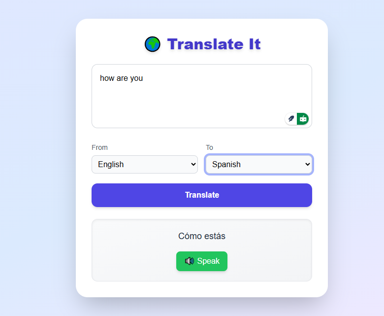

# Language Translator App

A modern and elegant **Language Translation Tool** built with **React (frontend)** and **Node.js + Express (backend)** using the **Azure Cognitive Services Translator API**.

This app provides a smooth and user-friendly way to translate text between multiple languages, listen to the translations, and easily copy results.

---

## Preview

### App UI



---

## Why We Used These Technologies

- **React:** For a fast, modular, and interactive frontend experience.
- **Tailwind CSS:** To create a sleek, responsive UI quickly without writing tons of CSS.
- **Node.js + Express:** Lightweight backend to handle API requests and integrate Azure services.
- **Azure Translator API:** Reliable, fast, and scalable machine translation with support for 100+ languages.
- **Web Speech API (Browser):** Enables Text-to-Speech without external libraries.

---

## Features

- **Multi-language translation** with Azure Translator API (10+ supported languages).
- **Text-to-Speech (TTS):** Hear the translated text directly.
- **Polished UI:** Built with Tailwind for a clean and modern look.
- **Separate Frontend & Backend:** Easier development and deployment workflow.
- **Cross-platform:** Works in any modern browser.

---

## Future Improvements

- **Voice Input:** Allow users to speak and get real-time translations.
- **Translation History:** Save and view past translations.
- **Offline Mode:** Cache common translations for offline use.
- **User Authentication:** Personalize translation history and preferences.
- **Mobile App Support:** Package as a PWA or React Native app.

---

## Project Structure
```
translation-tool/
│
├── backend/               # Node.js + Express API server
│   ├── server.js          # Main backend file
│   ├── package.json       # Backend dependencies
│   └── .env               # Stores Azure API key and region (not committed)
│
├── frontend/              # React frontend
│   ├── src/               # React source code
│   ├── package.json       # Frontend dependencies
│   └── public/
│
├── screenshots            # App screenshots
└── README.md
```

---

## Setup Instructions

### 1. Clone the Repo
```bash
git clone https://github.com/4h-m3d/LanguageTranslatorApp.git
cd LanguageTranslatorApp
```

### 2. Backend Setup
```bash
cd backend
npm install
```

Create a `.env` file in `backend/` with your Azure Translator details:
```
AZURE_TRANSLATOR_KEY=your-azure-key
AZURE_REGION=your-region
PORT=5000
```

Run the backend:
```bash
npx nodemon server.js
```

The server runs at: **http://localhost:5000**

### 3. Frontend Setup
In a new terminal:
```bash
cd frontend
npm install
npm start
```

The frontend runs at: **http://localhost:3000**

---

## Deployment Notes
- The app currently runs **frontend and backend separately** for development.
- To build the frontend for production:
```bash
cd frontend
npm run build
```
Then deploy `build/` to a static host (Netlify, Vercel) and host the backend on a server.

---

## Scripts

Backend:
```bash
cd backend
npm run dev   # Starts backend with nodemon
```

Frontend:
```bash
cd frontend
npm start     # Starts frontend
npm run build # Builds production version
```

---

## Tech Stack

- **Frontend:** React, Tailwind CSS
- **Backend:** Node.js, Express
- **Translation API:** Azure Cognitive Services
- **Speech:** Web Speech API
- **Deployment Ready:** Works with Netlify, Vercel, or traditional servers

---

## Directed by
Ahmed Nadeem
